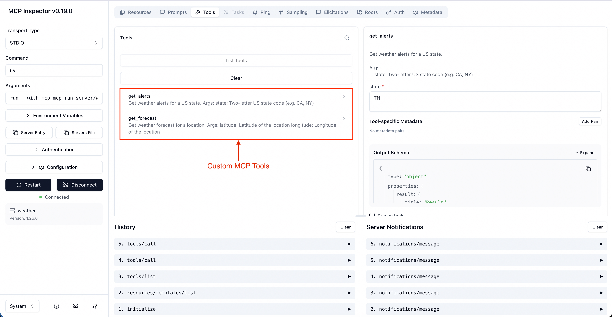
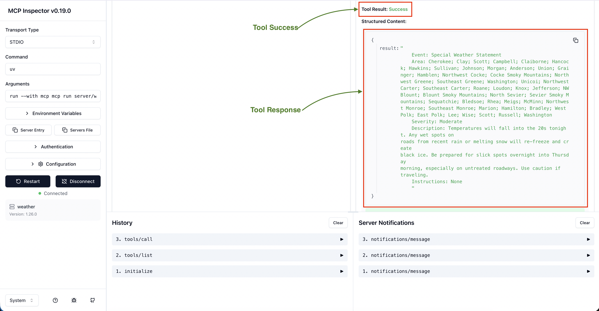
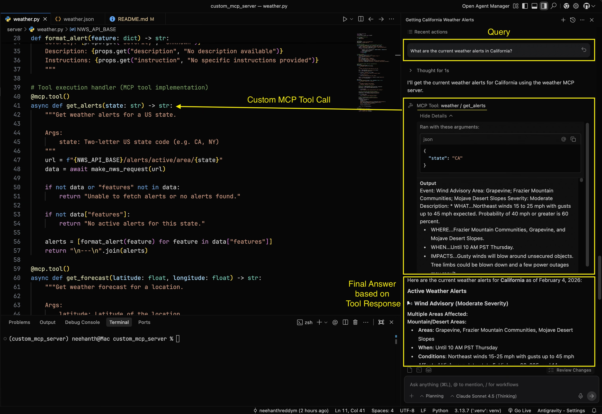

# MCP Server Demo


A basic implementation of a Model Context Protocol (MCP) server that provides weather information using the National Weather Service API.

## What is MCP?

The Model Context Protocol (MCP) is a standard that allows AI systems to connect with external tools and data sources. This server exposes weather-related tools that can be used by MCP-compatible clients.

## Features

This MCP server provides two main tools:

- **`get_alerts`**: Retrieves active weather alerts for any US state
- **`get_forecast`**: Gets detailed weather forecast for a specific location (latitude/longitude)

## Prerequisites

- Python 3.10+
- `uv` package manager

## Installation

1. Clone or navigate to the project directory:
```bash
cd custom_mcp_server
```

2. Install dependencies:
```bash
uv sync
```

## Running Locally

To run the MCP server in development mode:

```bash
uv run mcp dev server/weather.py
```

This command will:
- Start the MCP server
- Launch the MCP Inspector (a web-based testing interface)
- Automatically open your browser to the Inspector

## Testing with MCP Inspector

The **MCP Inspector** is an MCP Host that allows you to interact with your server and test its tools.

### MCP Inspector Dashboard
#### Tools


#### Tool Response


### Using the Inspector

1. After running the command above, the Inspector will open in your browser
2. You'll see your server's available tools listed in the interface
3. To test the tools:

#### Testing `get_alerts`:
- Select the `get_alerts` tool
- Enter a two-letter US state code (e.g., `CA` for California, `NY` for New York)
- Click "Run" to see active weather alerts

#### Testing `get_forecast`:
- Select the `get_forecast` tool
- Enter a latitude value (e.g., `39.7456`)
- Enter a longitude value (e.g., `-97.0892`)
- Click "Run" to see the detailed forecast

### Example Outputs

**get_alerts** returns formatted alerts with:
- Event type
- Affected area
- Severity level
- Detailed description
- Safety instructions

**get_forecast** returns a 5-period forecast with:
- Period name (e.g., "Tonight", "Tomorrow")
- Temperature
- Wind speed and direction
- Detailed forecast description

## Using with MCP Hosts (Claude Desktop, Antigravity, Cursor, etc.)

Once you've tested your server with MCP Inspector, you can use it with production MCP hosts.

### Installation

To install the server in Claude desktop app:

```bash
uv run mcp install server/weather.py
```

### Configuration

Configure your MCP host by adding this to your MCP tools configuration file:

**Configuration locations:**
- **Claude Desktop**: File -> Settings -> Developer
- **Antigravity**: Toggle Agent -> Aditional Options (3 dots on top-right corner) -> MCP Servers -> Mange MCP Servers -> View Raw Config
- **Cursor**: File -> Preferences -> Cursor Settings -> MCP

**JSON Configuration:**

```json
{
    "mcpServers": {
        "weather": {
            "command": "uv",
            "args": [
                "run",
                "--with",
                "mcp[cli]",
                "mcp",
                "run",
                ".../custom_mcp_server/server/weather.py"
            ]
        }
    }
}
```

> **Important**: Update the absolute path in the `args` array to match your local installation path.

### Testing with MCP Host

After configuration, restart your MCP host application and test with queries like:
- "What are the current weather alerts in California?"
- "Give me the weather forecast for San Francisco."

#### Example: Using Weather MCP Server with Antigravity


## Server Configuration

The server is configured in `server/weather.py`:
- **Name**: `weather`

## Transport Protocol: STDIO

This MCP server uses the **STDIO (Standard Input/Output) transport protocol** for communication between the client and server.

### How STDIO Transport Works

In the STDIO transport model:

1. **Process Model**: The MCP client launches the server as a subprocess
2. **Message Exchange**: 
   - The server receives JSON-RPC messages via its **standard input (stdin)**
   - The server writes responses to its **standard output (stdout)**
3. **Message Format**:
   - Messages are delimited by newlines
   - Messages **MUST NOT** contain embedded newlines
4. **Logging**:
   - The server **MAY** write UTF-8 strings to **standard error (stderr)** for logging purposes
   - Clients may capture, forward, or ignore these logs
5. **Critical Rules**:
   - The server **MUST NOT** write anything to stdout that is not a valid MCP message
   - The client **MUST NOT** write anything to the server's stdin that is not a valid MCP message

### Why STDIO?

STDIO transport is ideal for:
- Local development and testing
- Direct subprocess communication
- Simple client-server architecture without network overhead
- Easy debugging with the MCP Inspector

## Implementation Details

- Built with **FastMCP** framework
- Uses the National Weather Service (NWS) API
- Async/await for efficient API requests
- Proper error handling and timeouts
- STDIO transport for client-server communication

## Project Structure

```
custom_mcp_server/
├── server/
│   └── weather.py      # MCP server implementation
├── README.md           # This file
├── pyproject.toml      # Project dependencies
└── requirements.txt    # Python requirements
```

## Notes

- The NWS API only provides weather data for US locations
- Forecast data requires valid US coordinates
- The server includes a User-Agent header as required by NWS API guidelines

## References

This implementation is based on the [Model Context Protocol Python SDK](https://github.com/modelcontextprotocol/python-sdk) by Anthropic.
